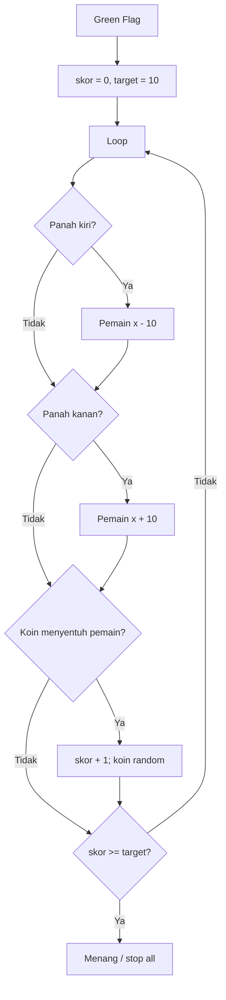

# Flowchart Game Tangkap Koin

```mermaid
flowchart TD
    A[Green Flag] --> B[skor = 0, target = 10]
    B --> C[Loop]
    C --> D{Panah kiri?}
    D -- Ya --> E[Pemain x - 10]
    D -- Tidak --> F{Panah kanan?}
    E --> F
    F -- Ya --> G[Pemain x + 10]
    F -- Tidak --> H{Koin menyentuh pemain?}
    G --> H
    H -- Ya --> I[skor + 1; koin random]
    H -- Tidak --> J{skor >= target?}
    I --> J
    J -- Tidak --> C
    J -- Ya --> K[Menang / stop all]
```
