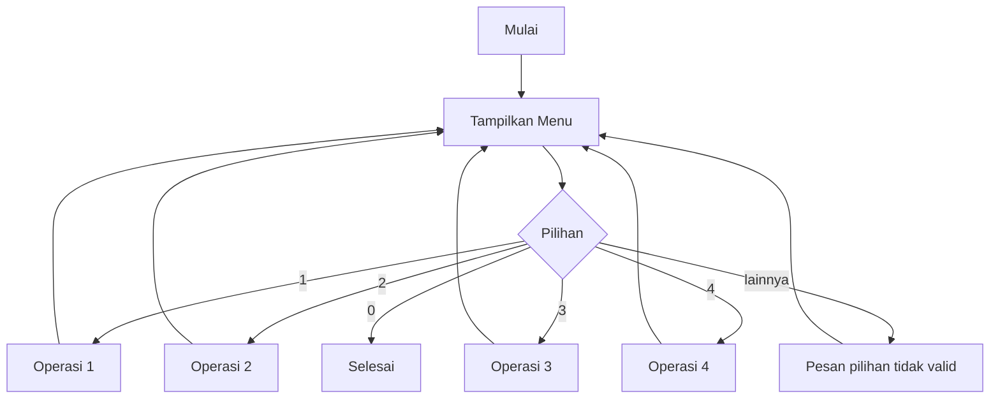

# Materi Pertemuan 08 — Project Checkpoint 1: Algoritma + Python Lokal + GitHub

> **Sumber utama:** *Buku Panduan Praktik: Pemrograman Dasar hingga Full Stack — 16 Pertemuan Terstruktur, Edisi Agustus 2026*.

Pertemuan 08 adalah **checkpoint**, bukan sesi untuk menambah framework baru. Peserta memilih satu dari 30 soal cerita dan hanya memakai kompetensi pertemuan 1–7: algoritma, input-output, condition, loop, list/dictionary sederhana, function, validasi, VS Code, Git, dan GitHub. Web, API, Node.js, dan database belum diperlukan.

## Target Kompetensi

Mahasiswa mampu:

- menerjemahkan soal cerita menjadi requirement yang terukur;
- menentukan input, proses, output, aturan, dan failure case;
- memilih list/dictionary yang sesuai untuk data in-memory;
- menyusun program CLI Python modular;
- membuat minimal lima function bermakna;
- menyediakan menu terminal dengan minimal empat operasi;
- melakukan validasi input dan menampilkan pesan yang mudah dipahami;
- menggunakan Git secara bertahap selama pengerjaan;
- menguji minimal delapan test case;
- membuat README sehingga orang lain dapat menjalankan program;
- mendemonstrasikan project dalam 3–5 menit.

## Output Pertemuan

1. Repository GitHub project.
2. Source Python yang berjalan lokal.
3. README.
4. Flowchart atau pseudocode.
5. Tabel test case.
6. Minimal lima commit progres.
7. Demo 3–5 menit.

---

# 8.1 Batas Teknologi

Checkpoint ini menilai penguasaan fondasi. Karena itu ruang lingkup teknologinya sengaja dibatasi.

### Boleh dipakai

```text
Python dasar
input / print
tipe data dan operator
if / elif / else
for / while
list / dictionary sederhana
function
validasi input
VS Code
terminal
Git
GitHub
```

### Belum diperlukan

```text
Flask / FastAPI
HTML / CSS / JavaScript web
REST API
Node.js
SQL / database
cloud deployment
```

Penyimpanan data ke file boleh menjadi bonus, tetapi **bukan syarat**. Data boleh hilang ketika program ditutup karena sasaran checkpoint adalah algoritma dan struktur program.

---

# 8.2 Aturan Bobot Setara

Semua pilihan project memiliki bobot inti yang sama:

- menu utama berbasis terminal dengan minimal empat operasi;
- menggunakan condition;
- menggunakan loop;
- menggunakan list atau dictionary;
- menggunakan function;
- memiliki validasi input;
- minimal lima function yang benar-benar mempunyai tugas;
- minimal delapan test case: normal, batas, input salah, dan data tidak ditemukan/kapasitas bila relevan;
- minimal lima commit Git yang memperlihatkan progres nyata.

Tidak dibenarkan menaruh seluruh logic dalam satu function besar hanya untuk memenuhi syarat “menggunakan function”.

---

# 8.3 Dari Soal Cerita Menjadi Requirement

Jangan langsung menulis kode. Baca soal dan pecah menjadi kalimat yang dapat diuji.

Contoh untuk **Kasir Kantin Sekolah**:

```text
Soal:
Kantin mempunyai daftar menu, menerima beberapa item pesanan,
menghitung subtotal dan diskon, lalu menampilkan ringkasan.
```

Ubah menjadi requirement:

| ID | Requirement | Cara membuktikan |
|---|---|---|
| R01 | program menampilkan menu | jalankan menu utama |
| R02 | pengguna dapat menambah item pesanan | input kode item valid |
| R03 | jumlah harus valid | uji 0/negatif/nonangka sesuai implementasi |
| R04 | item tidak dikenal ditolak | input kode yang tidak ada |
| R05 | subtotal dihitung dari harga × jumlah | bandingkan hitung manual |
| R06 | aturan diskon diterapkan | uji nilai tepat sebelum/di batas |
| R07 | ringkasan pembayaran tampil | selesaikan transaksi |

Requirement yang baik dapat dijawab **pass atau fail**.

---

# 8.4 Analisis Input–Process–Output

Sebelum membuat function, tulis IPO.

Contoh:

```text
INPUT
- pilihan menu
- kode barang
- jumlah

PROCESS
- cari barang
- validasi jumlah
- hitung subtotal
- akumulasi total
- hitung diskon

OUTPUT
- daftar pesanan
- subtotal
- diskon
- total bayar
- pesan kesalahan bila input tidak valid
```

Tambahkan juga state/data yang harus disimpan selama program berjalan.

---

# 8.5 Mendesain Data

Untuk data sederhana gunakan list atau dictionary.

Contoh katalog:

```python
menu = [
    {"kode": "N1", "nama": "Nasi Goreng", "harga": 15000},
    {"kode": "M1", "nama": "Mie Goreng", "harga": 12000},
    {"kode": "T1", "nama": "Teh", "harga": 5000},
]
```

Contoh pesanan:

```python
pesanan = []
```

Pertanyaan desain:

- data apa yang harus dicari?
- atribut apa yang dimiliki satu record?
- data mana yang dapat berubah?
- nilai apa yang harus dijaga agar tidak negatif?
- apakah duplikasi diperbolehkan?

---

# 8.6 Function Plan

Sesuai buku, minimal lima function bermakna.

Contoh rencana:

```text
tampilkan_menu()
cari_item(kode)
tambah_pesanan(...)
hitung_subtotal(...)
hitung_diskon(total)
tampilkan_ringkasan(...)
```

Sebelum implementasi, buat tabel:

| Function | Input | Return/output | Tanggung jawab |
|---|---|---|---|
| `cari_item` | kode | record/None | mencari satu item |
| `hitung_subtotal` | harga, jumlah | angka | perkalian |
| `hitung_diskon` | total | angka | aturan diskon |

Jika satu function mempunyai terlalu banyak deskripsi pada kolom “tanggung jawab”, pertimbangkan memecahnya.

---

# 8.7 Flowchart Menu CLI

Pola umum:



Flowchart spesifik project harus menunjukkan aturan penting, bukan hanya menu.

---

# 8.8 Skeleton Program

```python
def tampilkan_menu():
    print("1. Tampil data")
    print("2. Tambah data")
    print("3. Cari data")
    print("4. Operasi lain")
    print("0. Keluar")


def main():
    while True:
        tampilkan_menu()
        pilihan = input("Pilih: ").strip()

        if pilihan == "1":
            pass
        elif pilihan == "2":
            pass
        elif pilihan == "3":
            pass
        elif pilihan == "4":
            pass
        elif pilihan == "0":
            print("Program selesai.")
            break
        else:
            print("Pilihan tidak valid.")


if __name__ == "__main__":
    main()
```

Skeleton ini adalah titik awal, bukan jawaban akhir project.

---

# 8.9 Validasi sebagai Requirement

Contoh kasus yang harus dipikirkan:

- nama kosong;
- nilai di luar rentang;
- jumlah nol atau negatif;
- barang tidak ditemukan;
- data duplikat;
- stok tidak cukup;
- kapasitas penuh;
- pembatalan data yang tidak ada.

Validasi tidak hanya mencegah crash. Validasi menjaga aturan masalah tetap benar.

---

# 8.10 Testing Minimum

Buku mewajibkan minimal delapan test case. Gunakan kombinasi:

### Normal
Alur yang seharusnya berhasil.

### Boundary
Nilai tepat di batas, misalnya stok sama dengan jumlah pembelian atau nilai tepat 75.

### Invalid
Input yang tidak memenuhi rule.

### Not found / capacity
Data tidak ada atau resource sudah penuh jika relevan.

Template:

| ID | Requirement | Precondition/Input | Expected | Actual | Pass |
|---|---|---|---|---|:---:|
| T01 |  |  |  |  | ☐ |
| T02 |  |  |  |  | ☐ |
| T03 |  |  |  |  | ☐ |
| T04 |  |  |  |  | ☐ |
| T05 |  |  |  |  | ☐ |
| T06 |  |  |  |  | ☐ |
| T07 |  |  |  |  | ☐ |
| T08 |  |  |  |  | ☐ |

---

# 8.11 Git sebagai Catatan Progres

Minimal lima commit yang menunjukkan tahapan nyata. Contoh urutan:

```text
chore: siapkan struktur project
feat: tambah data dan menu utama
feat: tambah operasi inti
feat: tambah validasi input
fix: perbaiki kasus batas
 test/docs: tambah test case dan README
```

Pesan commit tidak wajib sama, tetapi harus menjelaskan perubahan stabil yang baru selesai.

Hindari membuat seluruh project lebih dulu lalu satu commit besar di akhir.

---

# 8.12 README Minimum

README project setidaknya menjawab:

```text
Apa masalah yang diselesaikan?
Apa fitur program?
Apa requirement lingkungan?
Bagaimana menjalankan program?
Bagaimana cara memakai menu?
Apa struktur data/function penting?
Apa contoh penggunaan?
Apa batasan program?
```

Contoh menjalankan:

```bash
python main.py
```

---

# 8.13 Demo 3–5 Menit

Demo singkat harus memperlihatkan:

1. masalah yang dipilih;
2. struktur program dan function utama;
3. satu alur normal;
4. satu boundary/invalid/not-found case;
5. Git history;
6. kesimpulan.

Demo bukan membaca seluruh source baris demi baris.

---

# 8.14 Rubrik Project

| Aspek | Bobot |
|---|---:|
| Analisis soal & flowchart | 15% |
| Fitur berjalan | 30% |
| Struktur function/data | 15% |
| Validasi & error handling | 15% |
| Testing | 10% |
| Git/GitHub & README | 10% |
| Demo & penjelasan | 5% |

Rubrik menilai proses dan struktur, bukan hanya “program bisa dibuka”.

---

# 8.15 Checklist Sebelum Pengumpulan

- [ ] Project dipilih dari 30 pilihan di `Project.md`.
- [ ] Tidak menggunakan teknologi di luar scope P01–P07 sebagai kebutuhan inti.
- [ ] Ada minimal empat operasi menu.
- [ ] Ada condition dan loop.
- [ ] Ada list/dictionary.
- [ ] Ada minimal lima function bermakna.
- [ ] Validasi input tersedia.
- [ ] Minimal delapan test case dicatat.
- [ ] Flowchart/pseudocode tersedia.
- [ ] README dapat diikuti orang lain.
- [ ] Minimal lima commit progres tersedia.
- [ ] Program dijalankan ulang dari kondisi awal sebelum diserahkan.
- [ ] Demo 3–5 menit sudah disiapkan.

Bank 30 project lengkap tetap berada di `Project.md`. Starter di `praktikum/starter-cli/` hanya menunjukkan struktur teknis dan tidak boleh dianggap sebagai jawaban untuk seluruh pilihan project.
