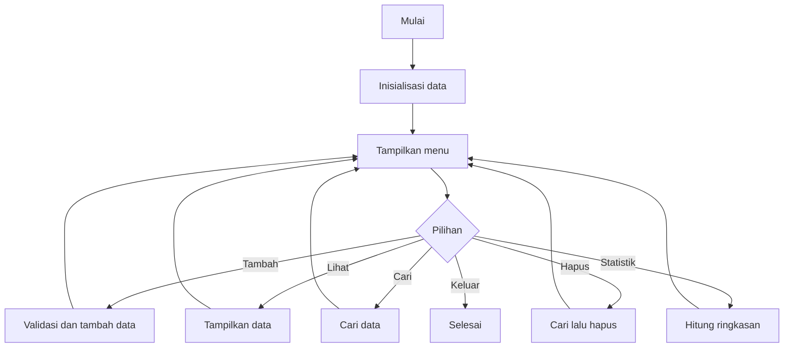

# Contoh Flowchart/Pseudocode — Checkpoint 1

## Flow Menu Utama



## Pseudocode

```text
START
buat data kosong
WHILE program aktif
    tampilkan menu
    baca pilihan
    jalankan function sesuai pilihan
    validasi input sebelum mengubah data
    tampilkan hasil operasi
END WHILE
END
```

## Tugas Mahasiswa
Flowchart di atas hanya contoh struktur. Ganti dengan flowchart project pilihan dan tambahkan minimal satu flow khusus untuk aturan penting, misalnya stok tidak cukup, kapasitas penuh, data duplikat, nilai batas, atau data tidak ditemukan.